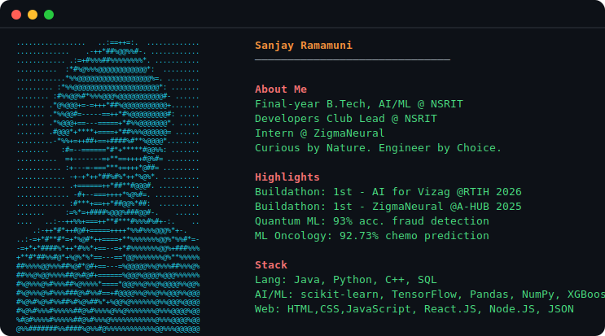

 

## 🌐 Socials

  

## 💻 Tech Stack

                                    

## 🏆 Key Highlights

[AI for Vizag Buildathon 2026](https://img.shields.io/badge/🥇_AI_for_Vizag_Buildathon_2026-1st_Prize_%7C_RTIH-fb923c?style=for-the-badge)
[ZigmaNeural Buildathon 2025](https://img.shields.io/badge/🥇_ZigmaNeural_Buildathon_2025-1st_Prize_%7C_Team_CrossStack-fb923c?style=for-the-badge)
[Quantum ML Fraud Detection](https://img.shields.io/badge/🤖_Quantum_ML_Fraud_Detection-93%25_Accuracy_%7C_Qiskit-22d3ee?style=for-the-badge)
[Chemo Response Prediction](https://img.shields.io/badge/🧬_Chemo_Response_Prediction-92.73%25_Accuracy_%7C_1100_Patients-22d3ee?style=for-the-badge)
[ALTA AI Builders Fellowship](https://img.shields.io/badge/🎓_ALTA_AI_Builders_Fellowship-Accepted-4ade80?style=for-the-badge)
[Developers Club Lead](https://img.shields.io/badge/👨‍💻_Developers_Club_Lead-NSRIT-4ade80?style=for-the-badge)

## 📊 GitHub Stats
 
 

### ✍️ Random Dev Quote

---

